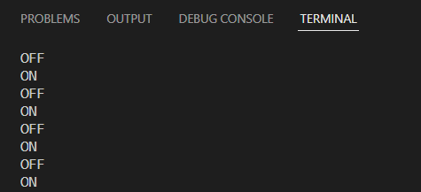
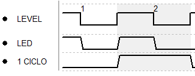

# Pràctica 1: BLINK
L'objectiu de la pràctica és entendre algunes funcions bàsiques d'Arduino: el setup i loop, sortides per terminal o l'assignació i utilització de pins.
___
## CODI DE LA PRÀCTICA
```
#include <Arduino.h>
#define PIN 16

void setup() {
  Serial.begin(115200);
  pinMode(PIN, OUTPUT);
}

void loop() {
  digitalWrite(PIN, HIGH);
  Serial.println("ON");
  delay(500);
  digitalWrite(PIN, LOW);
  Serial.println("OFF");
  delay(500);
}

```
___
## FUNCIONAMENT
Primerament s'ha definit el pin que s'utilitzaria pel led:
```
#define PIN 16
```
___
### Setup
Al setup definirem el codi a executar-se una sola vegada, el primer al executar el programa. S'ha definit el mode del pin com a pin de sortida:
```
void setup() {
  Serial.begin(115200);
  pinMode(PIN, OUTPUT);
}
```
___
### Loop 
```
  digitalWrite(PIN, HIGH);
  Serial.println("ON");
  delay(500);
```
La primera linia de codi assignarà al pin un valor alt, el que farà encendre el led que hi tenim conectat. Per poder fer un seguiment sense necessitat del led farem apareixer per pantalla "ON" quan el led estigui encés. Posteriorment el programa esperarà mig segon (500 ms) abans d'executar les següents linies de codi:
```
  digitalWrite(PIN, LOW);
  Serial.println("OFF");
  delay(500);
```
Seguidament s'assigna un valor baix al pin. El que farà que el led deixi de romandre encés. Novament es mostrarà un missatge per pantalla: "OFF". Finalment el programa tornarà a esperar 500ms per continuar. Un cop acabat el delay es tornarà a executar el loop desde el principi.
___
## Sortida pel terminal



___
## Diagrama de temps



## COMENTARIS
El processador té un temps lliure de 500ms, que és la finestra de temps que el programa s'atura entre canvi d'estats del pin (el delay). És a dir, el temps que passa el led encés, o apagat.

El temps d'execució d'un cicle loop és de 1 segons.


